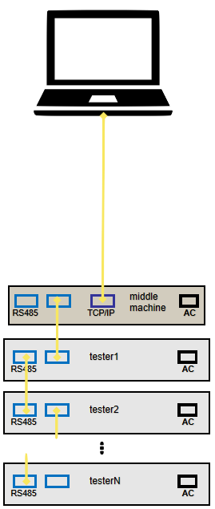

# Neware BTS4000 RS-485 Protocol
This work is the reverse engineering of the Neware BTS4000 series battery cyclers RS-485 communication protocol.

## Division of Responsibilities
The Middle Machine is responsible for control and intepretation of the vast majority of the battery testing process, while the battery cyclers exclusively respond to commands from the middle machine.

For example, the termination conditions for test steps are evaluated and handled by the middle machine. The cyclers report current and voltage values as ADC readings, which the middle machine then converts to physical values. The testers themselves do run the active feedback control to maintain specified physical conditions: current, power, voltage, etc.

| Middle Machine   | Tester         | 
| --------- | ------------- | 
| Evaluates step termination conditions | Active feedback control to maintain step conditions (IE constant current, constant power, etc.) |
| Converts ADC values to physical values |  Sets channel LED status based on channel activity       | 
| Sets the data aquisition frequency    | Continuously Samples the ADCs  |

## RS-485 Bus
The Neware BTS4000 battery cycler system uses a full-duplex, 3 Mbps RS-485 physical bus to connect the middle machine to all of the test units.

RS-485 layout from [Neware's official guide](https://newarebattery.com/how-to-start-to-use-neware-bst4000-series/)

### Bus UART Settings

| Setting   | Value         | 
| --------- | ------------- | 
| Baud Rate | 3,000,000 bps | 
| Byte Size | 8 bits        | 
| Parity    | None          | 
| Stop Bits | 1             | 

### Full-Duplex
The RS-485 implementation by Neware is ***full-duplex***. Note that this is relatively unusual for RS-485 implementations. That means that the controller (middle machine) transmits messages on one channel (twisted copper pair), and the receivers (testers) transmit on another channel. 

> Side note: This could have been implemented as a half-duplex bus. This full-duplex communication is not technically needed, as the middle machine must send a request before any tester responds and the testers only respond after the middle machine requests. However, if the two channels are bridged, the communications fail between the middle machine and the testers. So, I guess, full-duplex it is.

### Pinout
The Neware BTS4000 middle machine and testers use RJ45 jacks and standard ethernet cables for RS-485 communications. Each machine has two ports which are wired in electrical parallel to allow for easy daisy chaining. There is no difference between the two ports.

The pinout is as follows:

| Middle Machine Function  | Tester Function | Ethernet Wire Color (T568B) | RJ45 Pin |
| ------ | ------ | ------------ | - |
| R- (B) | T- (Z) | Green        | 6 |
| R+ (A) | T+ (Y) | Green/White  | 3 |
| T- (Z) | R- (B) | Orange       | 2 |
| T+ (Y) | R+ (A) | Orange/White | 1 |
| GND    | GND    | Brown        | 8 |
| GND    | GND    | Brown/White  | 7 |

> RJ45 pins 4 and 5 (Ethernet T568B colors Blue and Blue/White) are unused.

## Neware Communication Protocol
The protocol appears to be a custom implementation on top of RS-485 and does not follow common standards such as Modbus RTU, Profibus, DMX512, BACnet MS/TP, etc.

### Overview
The middle machine begins all communications. Every response from the testers is a direct response to a request from the middle machine. The testers have a watchdog timeout such that they will turn off all charge or discharge activity on all channels if they do not hear a message from the middle machine every few seconds.

Every message is 36 bytes long and consists of one byte of machine addressing, one byte of channel addressing, one byte of message type ID, a one byte CRC, and 32 bytes of payload.

| byte 0 | byte 1 | byte 2 | byte 3 | bytes 4 - 35 |
| ------ | ------ | ------ | ------ | ------------ |
| Machine ID | Channel ID | Message Type ID | CRC | Message Type Dependent Payload

> Note: There is no time information provided by the testers. All timestamps are added upon message reception by the middle machine.

### Machine Addressing
Machine ID is 0 indexed, while it is presented to the user as 1 indexed. IE Machine ID 0 corresponds to the tester with ID 1.

### Channel Addressing
Channel ID is 0 indexed, while it is presented to the user as 1 indexed. IE Channel ID 7 corresponds to the tester Channel 8.

### Message Type ID
The message type ID byte defines what the message type is. Specifically, bit 0 is flag for request ('0' if the message is a request/comes from the middle machine) or response ('1' if the message is a response/comes from a tester), and the remaining seven bits define the message type.

| bit 0 | bits 1-7 |
| ----- | -------- |
| Request (0) / Response (1) Flag | Message Type |

Some known message type IDs are defined below:

| ID | Description |
| ----- | -------- |
| 0x00  | Tester Response (Ping) Request |
| 0x80  | Tester Presence (Ping) Acknowledge |
| 0x02  | Change Unit ID Request |
| 0x82  | Change Unit ID Acknowledge |
| 0x17  | Constant Voltage Charge Request |
| 0x97  | Constant Voltage Charge Acknowledge |
| 0x18  | Constant Voltage Discharge Request |
| 0x98  | Constant Voltage Discharge Acknowledge |
| 0x1A  | Constant Current Charge Request |
| 0x9A  | Constant Current Charge Acknowledge |
| 0x1B  | Constant Current Discharge Request |
| 0x9B  | Constant Current Discharge Acknowledge |
| 0x1C  | Constant Power Discharge Request |
| 0x9C  | Constant Power Discharge Acknowledge |
| 0x1F  | Voltage and Current Request |
| 0x9F  | Voltage and Current Acknowledge |
| 0x25  | End of Test Request |
| 0xA5  | End of Test Acknowledge |
| 0x31  | Constant Power Charge Request |
| 0xB1  | Constant Power Charge Acknowledge |

### CRC
The CRC byte is a crc8-maxim-dow calculated on a modified message. Since the CRC byte is in the middle of the message instead of at the end, the process of using it is a bit unusual. The CRC is calculated on the full 36 byte message, with a dummy 0x00 value subbed into byte 3. The calculated CRC is then swapped into byte 3 before the message is transmitted.

**Transmission CRC Calculation**:
1. Build the message as intended, leave a dummy '0x00' value in byte 3.
2. Calculate the CRC using a crc8-maxim-dow algorithm on the 36 byte message with the dummy byte.
3. Place the calculated CRC in byte 3.
4. Transmit the 36 byte message.

**Reception CRC Checking**:
1. Receive the 36 byte message.
2. Copy the CRC out of byte 3.
3. Replace byte 3 with '0x00'
4. Calculate the CRC using a crc8-maxim-dow algorithm on the 36 byte message with the dummy byte
5. Compare the calculated CRC with the stored CRC from the message, checking for equality

-- Or --

4. Append the copied CRC byte to the end of the message
5. Calculate the CRC using a crc8-maxim-dow algorithm on the now 37 byte array (message + appended CRC)
6. Check the calculated CRC for equality with '0x00'

### Payload
The payload is message type dependent. Some known payloads are described below.

**Message 0x17: Constant Voltage Charge Request**

| Name | Byte Position | Physical Value to Bus Value Mapping |
| ----- | -------- | ----- |
| Voltage  | Bytes 4-7 | Physical Value = Bus Value / 3225.6 |

**Message 0x97: Constant Voltage Charge Acknowledge**

There is no payload for a Constant Voltage Charge Acknowledge

**Message 0x1A: Constant Current Charge Request**

| Name | Byte Position | Physical Value to Bus Value Mapping |
| ----- | -------- | ----- |
| Current  | Bytes 4-7 | Physical Value = Bus Value / Current Range Divisor |
| Current Range  | Byte 8 | See Table in 0x9F: Voltage and Current Acknowledge |

**Message 0x9A: Constant Current Charge Acknowledge**

There is no payload for a Constant Current Charge Acknowledge

**Message 0x1B: Constant Current Discharge Request**

| Name | Byte Position | Physical Value to Bus Value Mapping |
| ----- | -------- | ----- |
| Current  | Bytes 4-7 | Physical Value = Bus Value / Current Range Divisor |
| Current Range  | Byte 8 | See Table in 0x9F: Voltage and Current Acknowledge |

**Message 0x9B: Constant Current Discharge Acknowledge**

There is no payload for a Constant Current Discharge Acknowledge

**Message 0x1C: Constant Power Discharge Request**

| Name | Byte Position | Physical Value to Bus Value Mapping |
| ----- | -------- | ----- |
| Power  | Bytes 4-7 | Physical Value = Bus Value / Power Range Divisor |
| Power Range  | Byte 12 | See Table |

Strangely, only power range of 0x02 has ever been seen in logs, when setting the power value from 0.5W to 60W

| Power Range | Name | Description | Power Range Divisor |
| ----- | -------- | ----- | -------- |
| 0x00  | Low Range | ? A | ? |
| 0x01  | Mid Range | ? A | ? |
| 0x02  | High Range | 0 - 60 W | 268.8 |

**Message 0x9C: Constant Power Discharge Acknowledge**

There is no payload for a Constant Power Discharge Acknowledge

**Message 0x1F: Voltage and Current Request**

There is no payload for a Voltage and Current Request

**Message 0x9F: Voltage and Current Acknowledge**

| Name | Byte Position | Physical Value to Bus Value Mapping |
| ----- | -------- | ----- |
| Voltage  | Bytes 4-7 | Physical Value = Bus Value / 3225.6 |
| Current  | Bytes 8-11 | Physical Value = Bus Value / Current Range Divisor |
| Current Range  | Byte 33 | See Table |
| Channel Status | Byte 35 | See Table |

| Current Range | Name | Description | Current Range Divisor |
| ----- | -------- | ----- | -------- |
| 0x00  | Low Range | 0 - 1 A | 16128 |
| 0x01  | Mid Range | 1 - 6 A | 2688 |
| 0x02  | High Range | 6 - 12 A | 1344 |

| Channel Status | Description |
| ----- | ----- |
| 0x00  | Channel Active |
| 0x01  | Channel Invalid/Error |
| 0x02  | Channel Rest |

**Message 0x25: End of Test Request**

There is no payload for an End of Test Request

**Message 0xA5: End of Test Acknowledge**

There is no payload for an End of Test Acknowledge

**Message 0x31: Constant Power Charge Request**

| Name | Byte Position | Physical Value to Bus Value Mapping |
| ----- | -------- | ----- |
| Power  | Bytes 4-7 | Physical Value = Bus Value / Power Range Divisor |
| Power Range  | Byte 12 | See Table |

Strangely, only power range of 0x02 has ever been seen in logs, when setting the power value from 0.5W to 60W

| Power Range | Name | Description | Power Range Divisor |
| ----- | -------- | ----- | -------- |
| 0x00  | Low Range | ? A | ? |
| 0x01  | Mid Range | ? A | ? |
| 0x02  | High Range | 0 - 60 W | 268.8 |

**Message 0xB1: Constant Power Charge Acknowledge**

There is no payload for a Constant Power Charge Acknowledge

***TODO! Add more***