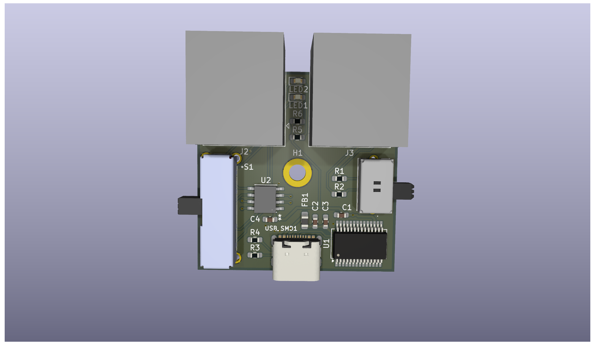
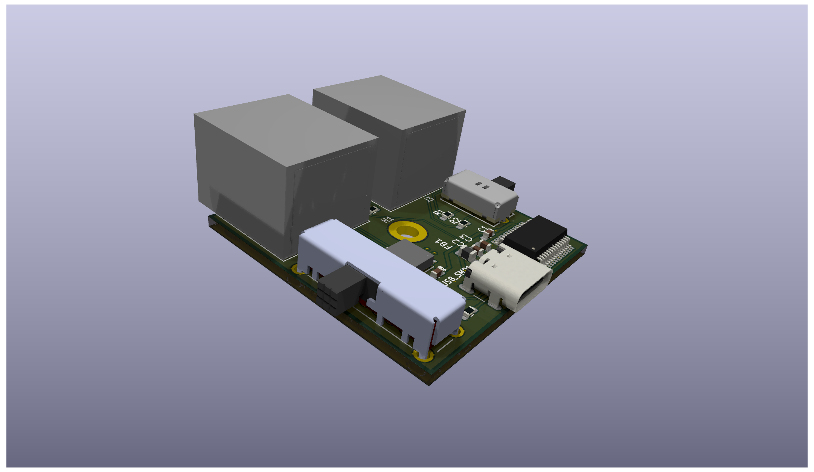
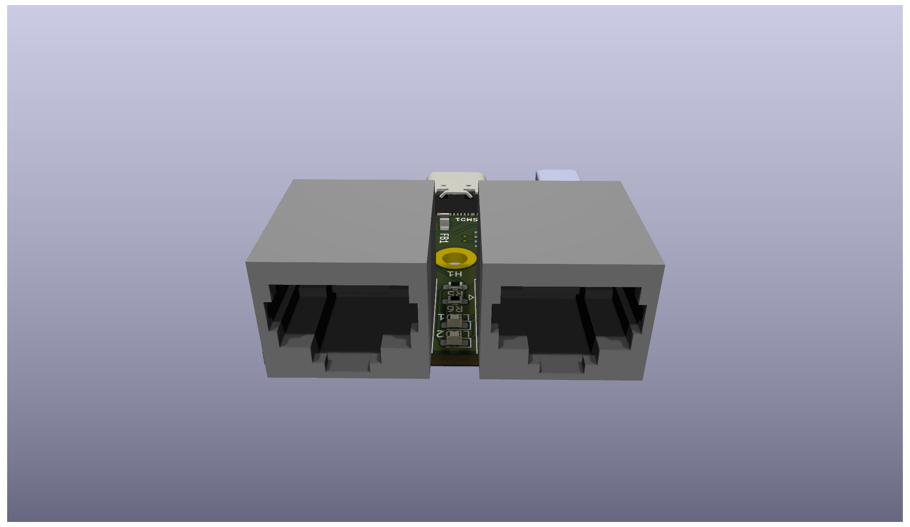
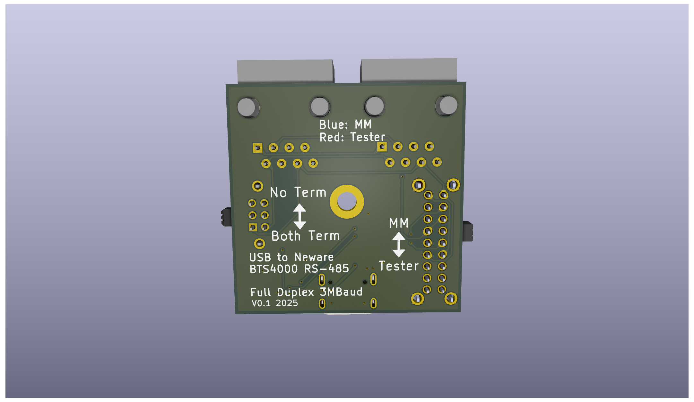

# Neware BTS4000 RS485 USB Interface






This is the Kicad project and output files for a USB Adapter that allows any computer to listen and transmit on the Neware BTS4000 RS485 bus. The adapter is based on the FTDI FT232RN chip, which includes drivers for all major operating systems. The transciever is a MaxLinear SP3077E, which allows for full duplex 3MBaud communication.

## RS485 Bus Connectors
The bus connectors are intended to duplicate the RS485 bus connections on a Middle Machine or Battery Tester. There are 2 RJ45 Jacks which are wired in parallel, allowing the device to be used in the same daisy-chain fashion as a Neware device. 

## Switches
The adapter includes 2 slide switches.

### Switch 1
Toggles the adapter between "Middle Machine Mode" and "Tester Mode". Since the RS485 bus is a full duplex bus, it matters which line the adapter is receiving on, and which it is transmitting on. With the switch slid towards the RJ45 jacks, the adapter acts as a middle machine, receiving on the same line that battery testers are transmitting on, and transmitting on the line that battery testers are receiving on. With the switch slid towards the USB-C jack, the adapter acts as tester, receiving from the middle machine and transmitting to the middle machine.

| Switch Position | Adapter Mode | Adapter TX | Adapter RX | LED Color |
| ------ | ------ | ------ | ------ | ------ |
| Towards RJ45 | Middle Machine | Middle Machine TX | Middle Machine RX | Blue |
| Towards USB-C | Tester | Middle Machine RX | Middle Machine TX | Red |

### Switch 2
Toggles the RS485 Termination Resistors on or off. With the switch slid towards the RJ45 jacks, there are no termination resistors on the bus. With the switch slid towards the USB-C jack, the adapter terminates the TX and RX busses with a 120Ω resistor on each bus. Whether or not you need the termination resistors enabled dependes on the length of the bus and what other devices are on the bus. A typical RS485 bus has a temination resistor enabled on both physical ends of the bus.

## PC Connection
The connection to a computer is a USB-C connector configured to run at USB 2.0 speeds. The USB connector has 5.1kΩ resistors on the CC lines, which allow it to work with USB C<->C cables or USB A<->C cables.

# Manufacturing
The ```outputs/manufacturing_files``` subfolder contains gerber and OBD files needed for PCB manufacturing, as well as the BOM file. The BOM contains manufacturer and part number data for digikey and LCSC to make sourcing parts easy regardless of where the boards are manufactured.

## Hand Assembly
All passives are 0603 or larger, with the large-pad footprints chosen to allow for hand soldering. Similarly, the pitch of all components should be large enough for hand soldering.